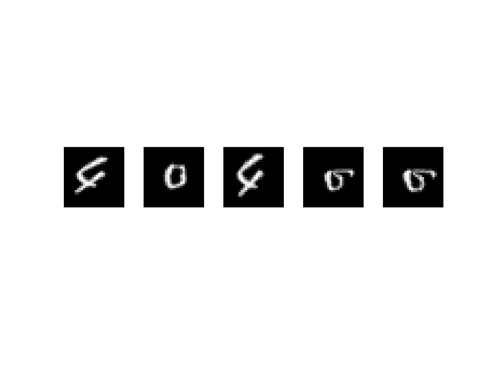

# Assignment 2: Evaluation and Error Analysis


### Introduction   
In this assignment, we are tasked at applying a CNN for regression on a 4D array of rotated images. Our goal is to predict angles of rotated handwritten digits. 

Since the assignment requires a specific matlab dataset, I wrote the assignment in matab. 


File Structure
```bash 
.
├── README.md
├── diaryFile
├── main.m
├── main.m~
└── reports
    ├── normalization.png
    ├── training.png
    └── worst5predictions.png
```
### Description of File Structure 
1. ***main.m*** - main matlab file 
2. **diaryFile** - outputs accuracy
3. ***reports/normalization*** - general distribution of angles in dataset
4. ***reports/traiing.png*** - verbose training progress
5. ***reports/worst5predictions*** - shows picture of the 5 worst predicted samples 


### Methods and Results 
After testing the neural network, the accuracy came out to be: 0.9590

The following are the top five worst predicted samples:


Note: if you would like to see the prediction error of these 5, uncomment line 108 in main.m 

```matlab
disp(maxIDX);
```

The general consensus from my model is that the worst predicted numbers involve the ***0, 4 and the 5*** digit. My reasoning behind this is for 0, some hadnwritten digits appear to be more circular so it would be hard to distinguish the rotation. For 4, I think the reasoning may be because 4 often looks like 9 in the dataset. Additionally, 5 often looks like 4 as well so predicting rotation may often be harder in these digits. 
